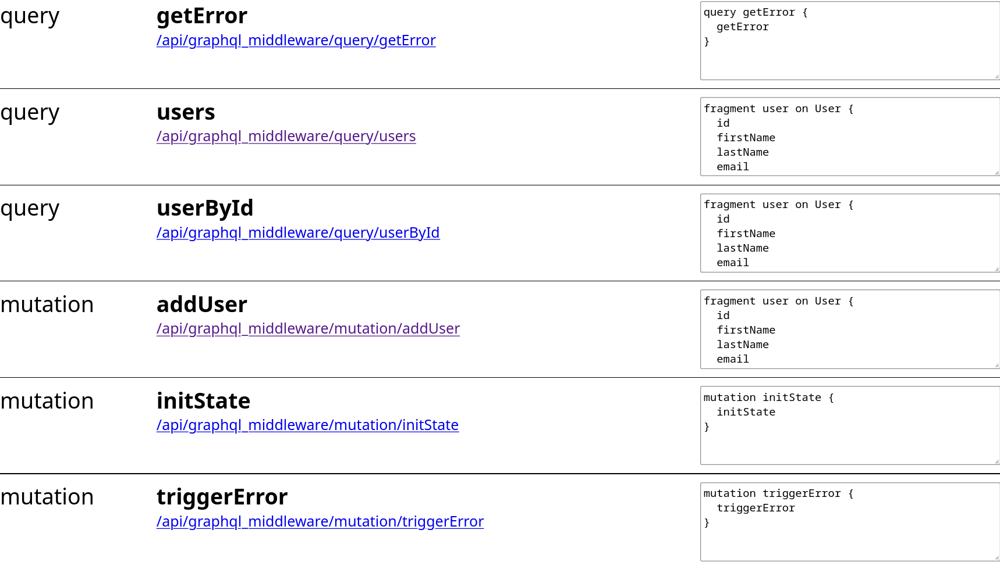

# Debugging

The module offers several ways to make it easier to debug GraphQL queries and
mutations.

## Debug Server Route

There is a server route available during development that outputs all queries
and mutations.

http://localhost:3000/api/graphql_middleware/debug

## Output compiled queries and mutations

If you set the `outputDocuments` option to `true` the module will output all
compiled documents in the build folder:
`./.nuxt/nuxt-graphql-middleware/documents`.
