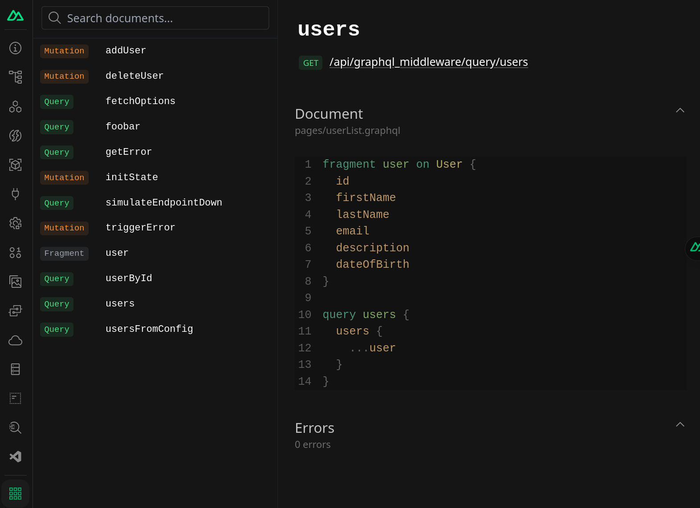

# Debugging

The module offers several ways to make it easier to debug GraphQL queries and
mutations.

## Nuxt DevTools

You can inspect queries, mutations and fragments within
[Nuxt DevTools](https://devtools.nuxtjs.org). Look for the **GraphQL
Middleware** tab.

## Debug Server Route

There is a server route available during development that outputs all queries
and mutations.

