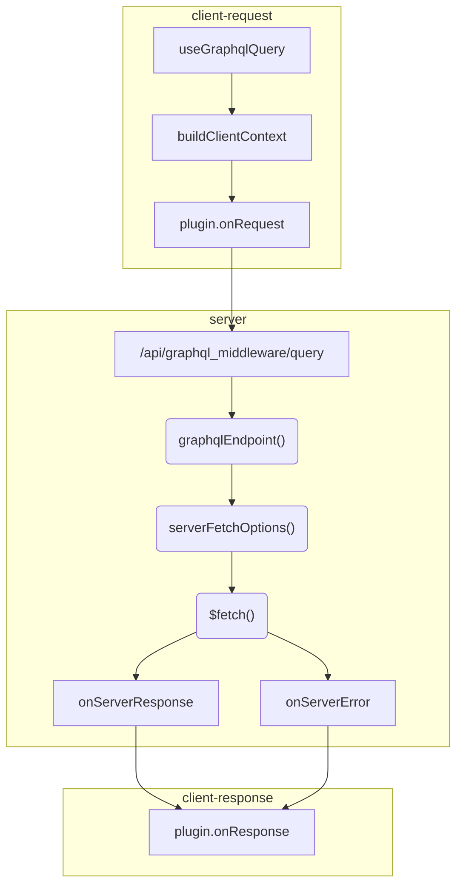

# Lifecycle

There are various steps that a GraphQL query goes through. Let's look at what
happens when you do `await useGraphqlQuery('myQuery')` in a component:

## Client (Request)

- Call `useGraphqlQuery()`
- If [client options](/configuration/client-options) are defined,
  buildClientContext() is called
- If [client fetch options](/composables/useGraphqlState) are defined, the
  `onRequest` fetch interceptor is called
- `$fetch()` request is started

## Server

- The `/api/graphql_middleware/query` server route handles the request
- The `serverOptions.graphqlEndpoint()` method is called to determine the URL of
  the GraphQL server
- The `serverOptions.serverFetchOptions()` method is called to get the fetch
  options for the request to the GraphQL server
- The fetch request to the GraphQL server is started
- If the request was successful:
  - The `serverOptions.onServerResponse` method is called
- If the request failed:
  - The `serverOptions.onServerError` method is called
- The response is sent to the client

## Client (Response)

- If [client fetch options](/composables/useGraphqlState) are defined, the
  `onResponse` fetch interceptor is called
- The result of the query is returned in the composable

